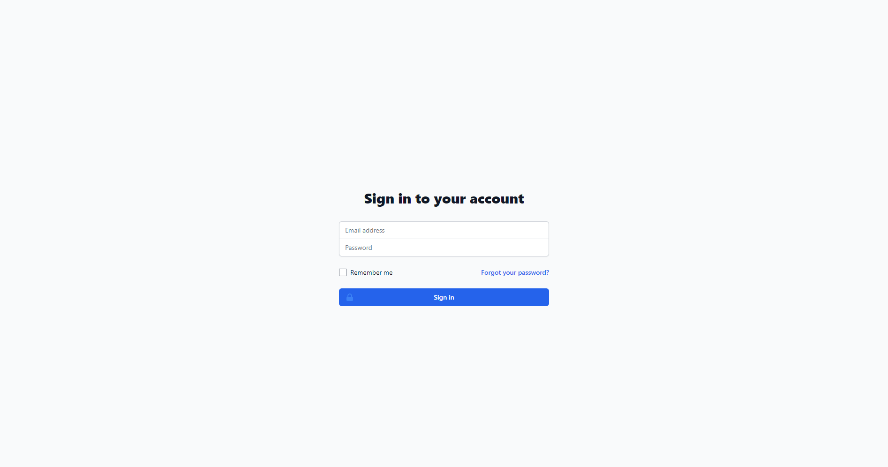
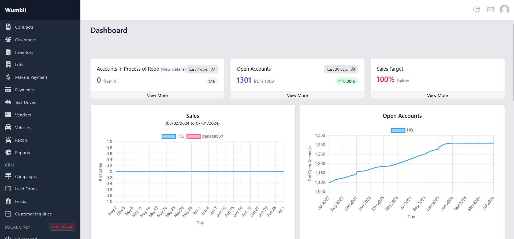

DMS required every user to sign in with their secure account.

After successful sign-in, you will be welcome by our beautiful dashboard.

import {FileTree} from "@astrojs/starlight/components";

### Modules
Below are the modules inside DMS system.

<FileTree>

- Dashboard
- Collections
- Contracts
- Customers
- Inventory
- Lots
- Make-A-Payment
- Payments
- Test-Drives
- Vendors
- Vehicles
- Recon
- Reports
- CRM
    - Campaigns
    - Lead-Forms
    - Leads
    - Customer-Inquiries

</FileTree>